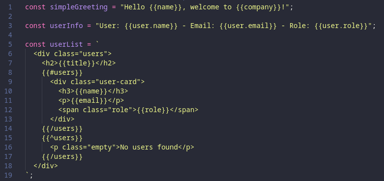
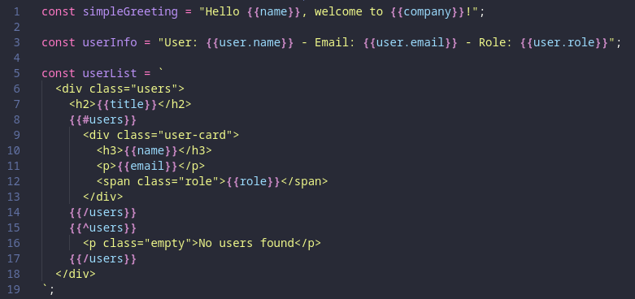

# Mustache Inline Highlighter

Syntax highlighting for Mustache templates embedded in TypeScript and JavaScript strings.

## Features

This extension adds syntax highlighting for Mustache expressions (`{{variable}}`, `{{#section}}`, etc.) directly in your TypeScript/JavaScript strings, making your code more readable and maintainable.

### Before


### After


## Supported Syntax

- Variables: `{{name}}`, `{{user.email}}`
- Sections: `{{#items}}...{{/items}}`
- Inverted sections: `{{^items}}...{{/items}}`
- Comments: `{{! comment }}`
- Partials: `{{>header}}`

## Supported Languages

- TypeScript (`.ts`, `.tsx`)
- JavaScript (`.js`, `.jsx`)

The extension works in:
- String literals: `"{{name}}"`
- Template literals: `` `{{name}}` ``
- Multiline strings

## Configuration

The extension is fully customizable through VS Code settings.

### Available Settings

| Setting                             | Type   | Default   | Description                              |
| ----------------------------------- | ------ | --------- | ---------------------------------------- |
| `mustacheInline.colors.brackets`    | string | `#C586C0` | Color for braces `{{` and `}}`           |
| `mustacheInline.colors.keywords`    | string | `#C586C0` | Color for control keywords `#`, `^`, `/` |
| `mustacheInline.colors.variables`   | string | `#9CDCFE` | Color for variables and names            |
| `mustacheInline.colors.embedded`    | string | `#4EC9B0` | Color for complete Mustache zone         |
| `mustacheInline.fontStyle.brackets` | string | `bold`    | Font style for braces                    |
| `mustacheInline.fontStyle.keywords` | string | `bold`    | Font style for keywords                  |

### Customization

#### Via GUI

1. Open settings: `Ctrl+,` (Windows/Linux) or `Cmd+,` (Mac)
2. Search for "Mustache Inline"
3. Modify colors according to your preferences

#### Via settings.json

```json
{
  "mustacheInline.colors.brackets": "#FF6B6B",
  "mustacheInline.colors.keywords": "#4ECDC4",
  "mustacheInline.colors.variables": "#FFE66D",
  "mustacheInline.colors.embedded": "#95E1D3",
  "mustacheInline.fontStyle.brackets": "bold",
  "mustacheInline.fontStyle.keywords": "bold italic"
}
```

### Predefined Color Themes

#### Default Theme (Dark+)
```json
{
  "mustacheInline.colors.brackets": "#C586C0",
  "mustacheInline.colors.keywords": "#C586C0",
  "mustacheInline.colors.variables": "#9CDCFE",
  "mustacheInline.colors.embedded": "#4EC9B0"
}
```

#### Ocean Theme
```json
{
  "mustacheInline.colors.brackets": "#89DDFF",
  "mustacheInline.colors.keywords": "#C792EA",
  "mustacheInline.colors.variables": "#82AAFF",
  "mustacheInline.colors.embedded": "#8BD5CA"
}
```

#### Warm Theme
```json
{
  "mustacheInline.colors.brackets": "#F78C6C",
  "mustacheInline.colors.keywords": "#FF5370",
  "mustacheInline.colors.variables": "#FFCB6B",
  "mustacheInline.colors.embedded": "#C3E88D"
}
```

## Commands

| Command                         | Description                        |
| ------------------------------- | ---------------------------------- |
| `Mustache Inline: Apply Colors` | Manually reapply configured colors |

To execute a command: `Ctrl+Shift+P` (Windows/Linux) or `Cmd+Shift+P` (Mac)

## Usage Examples

### TypeScript
```typescript
const template = `
  <h1>{{title}}</h1>
  {{#users}}
    <div class="user">
      <span>{{name}}</span>
      <span>{{email}}</span>
    </div>
  {{/users}}
  {{^users}}
    <p>No users found</p>
  {{/users}}
`;
```

### JavaScript
```javascript
const greeting = "Hello {{user.name}}, you have {{notifications}} notification(s).";

const html = `
  <div>
    {{! This is a comment }}
    {{>header}}
    <main>{{content}}</main>
    {{>footer}}
  </div>
`;
```

## Installation

### From VSIX Package

1. Download the latest `.vsix` file from [Releases](https://github.com/Ayce45/mustache-inline-javascript-typescript-highlighter/releases)
2. Install via the command line:
   ```bash
   code --install-extension mustache-inline-javascript-typescript-highlighter-*.vsix
   ```
   Or install via VS Code: `Ctrl+Shift+P` > "Extensions: Install from VSIX..." and select the downloaded file

### From Local Folder

1. Copy the extension folder to `.vscode/extensions/mustache-inline/`
2. Reload VS Code: `Ctrl+Shift+P` > "Developer: Reload Window"

### From Workspace

The extension is automatically loaded if located in the `.vscode/extensions/` folder of your workspace.

## Troubleshooting

### Colors Are Not Applying

1. Check that the extension is activated: open debug console (`Help` > `Toggle Developer Tools`)
2. Look for the message: "Mustache Inline Highlighter est active"
3. Execute manually: `Ctrl+Shift+P` > "Mustache Inline: Apply Colors"
4. Reload window: `Ctrl+Shift+P` > "Developer: Reload Window"

### Colors Don't Change After Modification

1. Wait a few seconds (application is automatic)
2. If necessary, execute "Mustache Inline: Apply Colors"
3. Verify that hexadecimal values are valid (e.g., `#FF0000`)

### Conflict With Other Extensions

If you have other Mustache highlighting extensions, disable them to avoid conflicts:
1. `Ctrl+Shift+X` > Extensions
2. Search for Mustache extensions
3. Disable conflicting extensions

## Contributing

For any suggestions or bugs:

1. Check that the issue doesn't already exist
2. Provide a code example reproducing the problem
3. Include your configuration (`mustacheInline.*` settings)

## License

MIT

## Changelog

### 1.0.0 (2025-10-06)

- Initial release
- Syntax highlighting for Mustache in TS/JS strings
- Complete color and style configuration
- Custom theme support
- Manual reapplication command

## Resources

- [Mustache Documentation](https://mustache.github.io/)
- [VS Code Extension API](https://code.visualstudio.com/api)
- [TextMate Grammar](https://macromates.com/manual/en/language_grammars)
